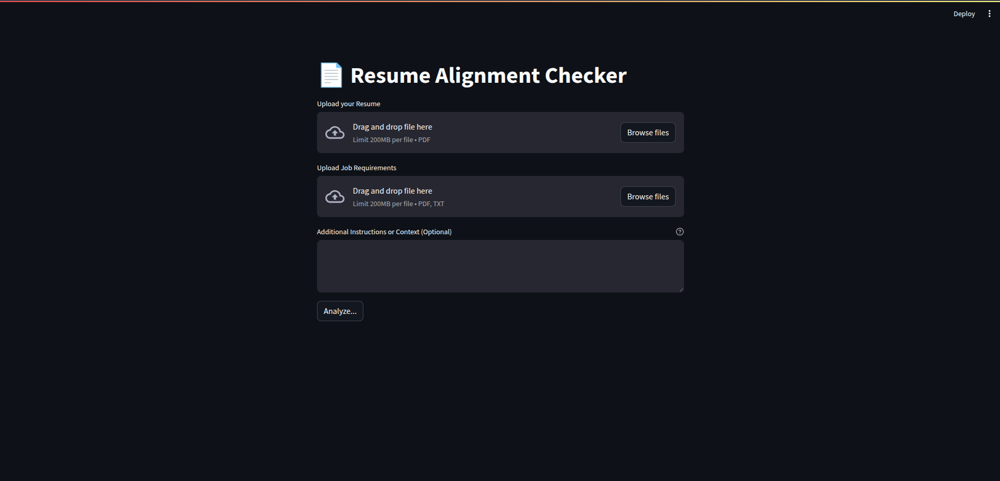
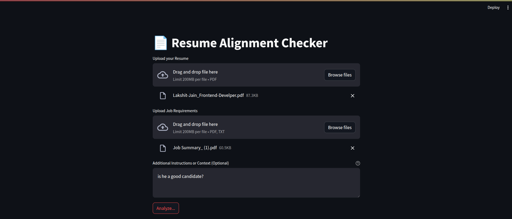
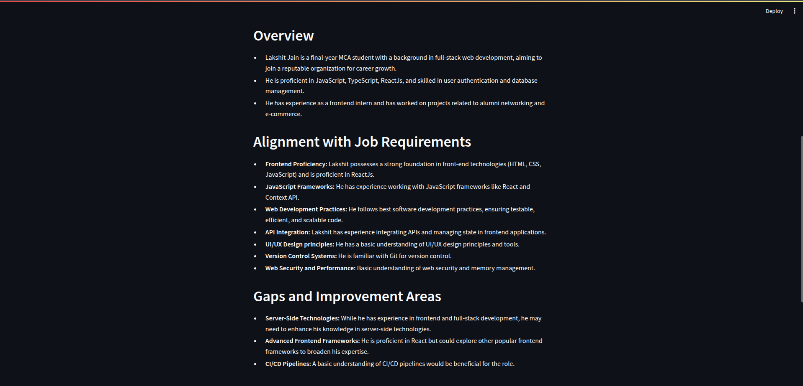
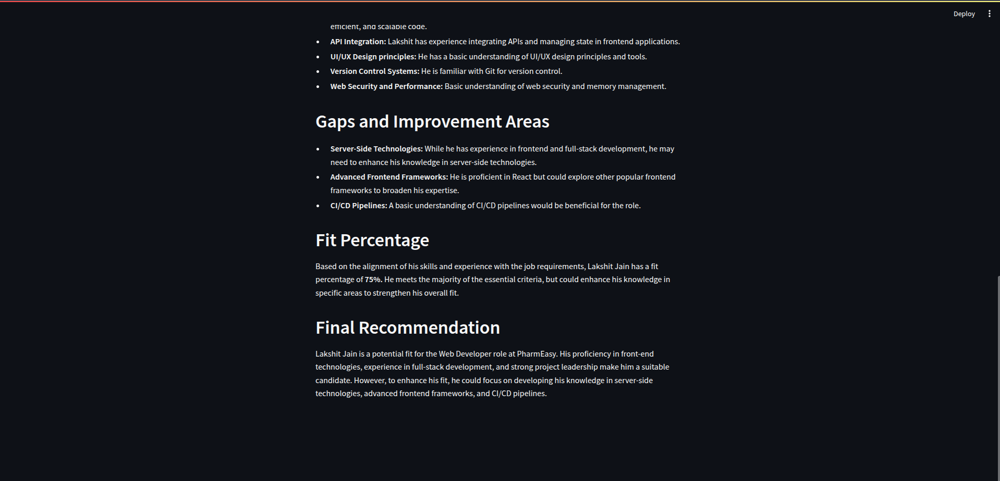

# 🎯 AI-Powered Job Fit Assessment

## Description

This AI-Powered Job Fit Assessment tool helps streamline the job application process by analyzing the alignment between resumes and job requirements. The system provides comprehensive evaluations of candidates' fit for positions, making it easier for both recruiters and job seekers to assess compatibility.

## Features

- 🔍 ATS Resume Checker
- 📈 Job Alignment Analysis
- 📝 Cover Letter Generator
- 💼 Job Search
- Resume compatibility analysis
- ATS score evaluation
- Detailed alignment analysis
- Percentage-based fit scoring

The tool uses advanced natural language processing to:

- Analyze resumes against job requirements
- Provide detailed alignment analysis
- Calculate fit percentages
- Offer improvement suggestions
- Generate comprehensive recommendations

## Preview


<br>

<br>

<br>


## Technologies Used

- Python
- Streamlit
- LangChain
- Google Gemini AI
- PyPDF2
- TOML Configuration

## Features

- PDF resume upload
- PDF/TXT job requirements upload
- Custom theme configuration
- Detailed alignment analysis
- Percentage-based fit scoring
- Actionable improvement suggestions
- Additional context input option

## Setup and Configuration

### Prerequisites

- Python 3.8 or higher
- Google Gemini API key

### Environment Setup

1. Create a `.env` file in the project root:

```bash
GEMINI_API_KEY=your_gemini_api_key_here
```

## Installation

1. Clone the repository:

```bash
git clone https://github.com/your-username/job-fit-assessment.git
```

2. Navigate to the project directory:

```bash
cd job-fit-assessment
```

3. Create a virtual environment:

```bash
python -m venv venv
```

4. Activate the virtual environment:

```bash
source venv/bin/activate
```

5. Install dependencies:

```bash
pip install -r requirements.txt
```

6. Run the application:

```bash
streamlit run app.py
```

## Usage

1. Upload your resume (PDF format) to the Career Fit AI platform.
2. Upload job requirements (PDF or TXT format) for the desired position.
3. (Optional) Provide any additional context or specific instructions to tailor the analysis.
4. Click "Analyze" to receive a comprehensive career fit assessment.
5. Review the fit percentage and detailed alignment analysis to understand your compatibility with the job.
6. Utilize the actionable suggestions to enhance your application and improve your career fit.

## Contribution

Contributions are welcome! Please fork the repository and submit a pull request for any enhancements or bug fixes.

## License

This project is licensed under the MIT License. See the [LICENSE](LICENSE) file for details.
